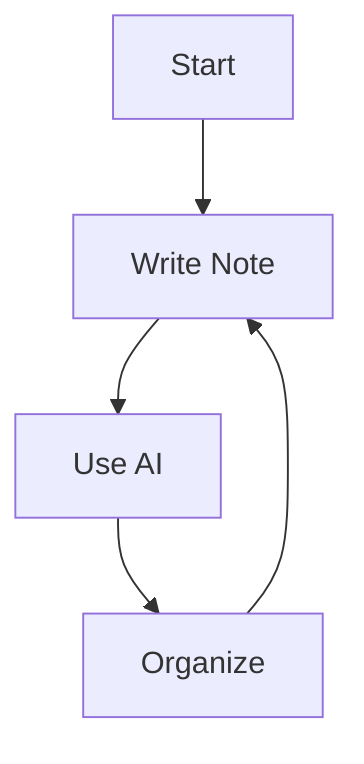

# Markdown Formatting Guide

A quick guide to formatting notes in MindVault Notes.

## Text Formatting

- **Bold**: `**text**` or `__text__`
- *Italic*: `*text*` or `_text_`
- ~~Strikethrough~~: `~~text~~`
- `Code`: `` `code` ``

## Lists

### Unordered
- Item 1
- Item 2
  - Nested item

### Ordered
1. First item
2. Second item
3. Third item

### Task Lists
- [x] Completed task
- [ ] Pending task

## Code Blocks

```javascript
function hello() {
  console.log('Hello, MindVault!')
}
```

## Quotes

> This is a blockquote.
> It can span multiple lines.

## Tables

| Feature | Status |
|---------|--------|
| Editor  | ✅     |
| AI      | ✅     |
| Search  | ✅     |

## Math (LaTeX)

Inline: $E = mc^2$

Block:

$$
\sum_{i=1}^{n} x_i = x_1 + x_2 + \cdots + x_n
$$

## Diagrams (Mermaid)



## Links & Images

- [Link text](https://example.com)
- 

---

*For more details, see the full documentation.*
